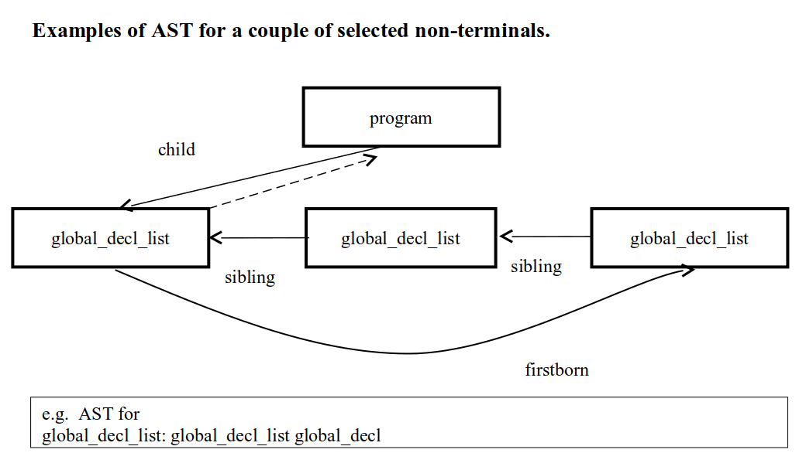

Homework Assignment 3:
A Syntax Analyzer for the C-- Language
======================================
(Posted on 10/20, Due 11/10 9:59PM)

# Homework#3: A syntax recognizer and AST (Abstract Syntax Tree) generation for C-- programs #

**Part 1.** \
In the template file, `parser.y`, we have provided an incomplete set of C-- production rules. Your job is to fill the missing productions (they are marked by C comments, e.g. `/**/`) so that the parser you created through Yacc/Bison can parse correct C-- programs.

**Part 2.** \
In a multi-pass compiler, we usually generate an AST during the syntax checking pass. A few follow-up passes such as semantic checking and code generation can be performed based on the AST. There are some AST building action routines already added as a reference for you in the `parser.y`. However, the majority of such actions are missing from the `parser.y` file. The missing production rules and the associated actions are marked by C comments, e.g. `/*TODO*/`, in the `parser.y` template. You need to fill in such production rules and the respective actions. You can build the AST using the node structures we provided in the `header.h`.

You may not have a good idea on how to write action routines at this time. However, we will cover AST generation in class after the midterm exam (10/26). So you may start working on this assignment by first adding the missing production rules first, and test the parsing functions of the generated parser. Actions for building AST can be added later after we discuss AST building in class.

The generated AST will be printed out to an AST.gv file via the `printGV()` call (This has been coded in the `parser.y` main function). TAs will check the correctness of the AST generated from your parser. `AST.gv` can be viewed graphically by the GVedit tool, (you can download from http://www.graphviz.org/ ). That graphic layout could help you see the AST structures better and debug your action routines more effectively.

Additional Notes:

1. You may assume the identifier names will not exceed 256 characters. However, the number of distinct identifiers should not be limited.
2. In the Homework3 directory you may find the following files:
   1. `src/lexer.l`      the sample lex program that you may start with
   2. `src/header.h`     contains AST data structures
   3. `src/Makefile`
   4. `src/parser.y`     template YACC/Bison file with incomplete production rules
   5. `src/functions.c`  functions that can be used to generate the `AST.gv`
   6. `pattern/*.c`      test data files
   7. `tar.sh`           packaging script file

Submission requirements:

1. DO NOT change the executable name (parser).
2. Use the script file “`tar.sh`” to wrap up your assignment works into a single file. Then upload your packaged file to CEIBA.

   Usage: `./tar.sh` source_directory `studentID1_studentID2` (all student IDs in your team) version_number \
   Example: `./tar.sh hw 12345_12346 ver1` \
   Output: `12345_12346_ver1.tar.bz2` (submit this file)

3) We grade the assignments on the linux1 workstation (linux1.csie.org). Before summiting your assignment, you should make sure your version works correctly on linux1.

**Examples of AST for a couple of selected non-terminals.**

